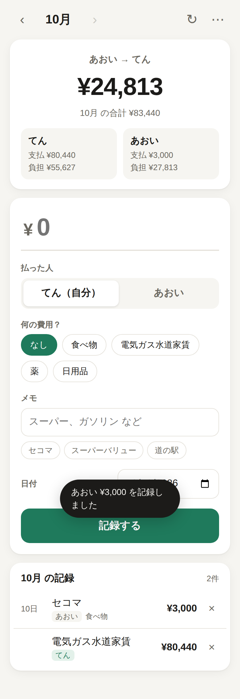

# わりかん（ホーム画面に置ける生活費アプリ・運用コスト 0 円）

2 人の生活費をスマホから記録して、てん 2/3・あおい 1/3 で割り勘するアプリです。
記録はいつもの Google スプレッドシート「食費と生活費」にそのまま書き込まれます。



## しくみと費用

```
📱 ホーム画面のアイコン（PWA）
   画面のファイルは Cloudflare Pages に置く
        │ 記録・削除・集計の読み込み（合言葉つき）
        ▼
⚙️ Google Apps Script（スプレッドシートに付けたスクリプト）
        │
        ▼
📊 スプレッドシート「食費と生活費」（月ごとのシート・2:1 の式はそのまま）
```

| 部分 | 使うもの | 料金 |
| --- | --- | --- |
| 画面（アイコン・入力画面） | Cloudflare Pages | 無料（静的ファイルの配信は回数無制限） |
| 記録・集計の処理 | Google Apps Script | 無料（2 人で使う程度なら無料枠に余裕あり） |
| データ | Google スプレッドシート | 無料 |

## できること

- 金額を入れて「記録する」→ その月のシートの一番下に `日付 / 金額 / 誰が払ったか / 何の費用？ / メモ` を追記
- 精算額（「あおい → てん ¥24,813」）をいつも上に表示。数字はシートの集計欄の値そのもの
- よく使うメモ（セコマ、スーパーバリュー…）がボタンで出て、押すとカテゴリも自動で入る
- 払った人の切り替え（いつもは自分）、日付の変更（先月の日付なら先月のシートへ）
- 記録の一覧と削除（どの行でも消せる。G 列より右の集計欄やメモは動かさない）
- 過去の月の表示（‹ › かプルダウン）
- 電波がないときは「送信待ち」としてスマホにため、つながったら自動で送る（二重記録はしない）
- 新しい月は、最初に開いたときに `template` をコピーして `2026/11` のようなシートを自動で作る
- ダークモード対応

## セットアップ（20 分くらい）

### 1. スプレッドシートに Apps Script を入れる

1. スプレッドシート「食費と生活費」を開き、「拡張機能」→「Apps Script」
2. 最初からある `コード.gs` の中身を全部消して、[`gas/Code.gs`](gas/Code.gs) の中身を貼り付けて保存
3. 左の歯車「プロジェクトの設定」でタイムゾーンを「(GMT+09:00) 東京」にする
4. エディタに戻り、上の関数選択で `setup` を選んで「実行」
   - 承認画面が出たら許可（「このアプリは確認されていません」→「詳細」→「（安全ではないページ）に移動」）

### 2. Apps Script をウェブアプリとして公開する

1. 右上の「デプロイ」→「新しいデプロイ」→ 種類「ウェブアプリ」
   - 次のユーザーとして実行: **自分**
   - アクセスできるユーザー: **全員**
2. 「デプロイ」を押す（URL はあとで自動で使うので、メモしなくて OK）

> 「全員」にしても、合言葉を知らない人は何も読み書きできません。

### 3. 画面を Cloudflare Pages に公開する

どれか 1 つの方法で、`warikan/web` フォルダを公開します。

- **A. ドラッグ＆ドロップ（いちばん簡単）**
  Cloudflare のダッシュボード →「Workers & Pages」→「作成」→「Pages」→「アセットをアップロード」→
  プロジェクト名 `warikan` → `web` フォルダの中身をドラッグ＆ドロップ →「デプロイ」
- **B. GitHub と連携（更新が自動になる）**
  「Workers & Pages」→「作成」→「Pages」→「Git に接続」→ このリポジトリを選び、
  フレームワーク「なし」、ビルドコマンド「空欄」、ビルド出力ディレクトリ `warikan/web`
- **C. コマンド**（API トークンがある場合）: `cd warikan && npx wrangler pages deploy web --project-name warikan`

公開されると `https://warikan-xxx.pages.dev` のような URL が出ます。

### 4. セットアップ用リンクを作る

1. Apps Script の `Code.gs` の上のほうにある `APP_URL: 'https://warikan.pages.dev/'` を、3 の URL に書き換えて保存
2. 関数選択で `printSetupLink` を選んで「実行」
3. 実行ログに `https://warikan-xxx.pages.dev/#setup=...` というリンクが出るのでコピー

> このリンクは家計簿の鍵です。2 人以外には教えないでください。

### 5. スマホに入れる（2 人とも）

1. セットアップ用リンクをスマホに送り（自分あてのメモや LINE の Keep など）、開く
2. 「このスマホを使うのはだれ？」で自分の名前を選ぶ
3. ホーム画面に追加
   - **iPhone**: Safari で開いた状態で、共有ボタン →「ホーム画面に追加」
     （必ずセットアップ用リンクを開いた画面のまま追加してください。iPhone はホーム画面のアプリと Safari で保存場所が別なので、
     リンクごと追加するとアプリ側でも自動で設定されます）
   - **Android**: Chrome のメニュー →「ホーム画面に追加」または「アプリをインストール」
4. ホーム画面の「わりかん」アイコンから開いて、名前をもう一度選べば完了

## 困ったとき

- **「接続できませんでした」**: 2 の「アクセスできるユーザー」が「全員」になっているか確認。Apps Script の「実行数」でエラーを確認
- **Apps Script のコードを更新した**: 「デプロイ」→「デプロイを管理」→ 鉛筆アイコン → バージョン「新バージョン」→「デプロイ」
  （「新しいデプロイ」を作ると URL が変わるので、セットアップし直しが必要になります）
- **画面のファイルを更新した**: もう一度 Cloudflare Pages にアップロード。スマホはアプリを 2 回開き直すと新しい版になります
- **スマホをなくした**: Apps Script で `resetKey` を実行（古い合言葉が使えなくなる）→ `printSetupLink` で新しいリンクを作って、2 人ともセットアップし直す
- **名前を間違えた**: アプリ右上の「⋯」から変更できます
- **割合を変えたい**: シート（template）の `I5` `I6` の式を変更。アプリの表示も自動で変わります

## 開発者向け

```sh
cd warikan
npm install        # playwright-core（画面のテスト用）
npm test           # API のテスト + 本物のブラウザで画面を動かすテスト
```

- `gas/Code.gs` … Apps Script の API（`load` / `add` / `delete`）
- `web/` … PWA（ビルド不要の HTML / CSS / JS）。`sw.js` でオフラインでも開ける
- `test/gas-mock.js` … Apps Script とスプレッドシート（template と同じ式）のモック
