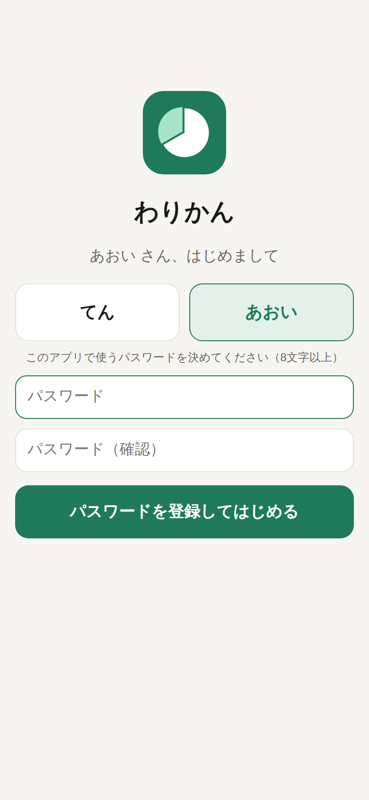

# わりかん（ホーム画面に置ける生活費アプリ・運用コスト 0 円）

2 人の生活費をスマホから記録して、てん 2/3・あおい 1/3 で割り勘するアプリです。
Cloudflare だけで動きます（Google Apps Script やスプレッドシートは使いません）。

<p>
  
  
</p>

## しくみと費用

```
📱 ホーム画面のアイコン（PWA）
        │
        ▼
☁️ Cloudflare Pages
   ├ public/     画面（HTML / CSS / JS）
   └ functions/  API（ログイン・記録・集計）── Cloudflare D1（データベース）
```

| 使うもの | 無料枠 | このアプリの使用量 |
| --- | --- | --- |
| Cloudflare Pages（画面） | 静的ファイルの配信は無制限 | — |
| Pages Functions（API） | 1 日 10 万リクエスト | 2 人で 1 日数十回 |
| Cloudflare D1（データ） | 5 GB・1 日 500 万行の読み取り | 何十年分でも数 MB |

クレジットカードの登録も不要です。

## できること

- **ログイン**: 名前を選んでパスワードを入力。はじめての人はその場でパスワードを登録（8 文字以上）。
  一度ログインすると 1 年間ログインしたまま。パスワードを 10 回間違えると 15 分ロック
- **記録**: 金額・払った人（いつもは自分）・だれの分？・何の費用？・メモ・日付。よく使うメモはボタンで出て、押すとカテゴリも入る
- **だれの分？**: ふたりで（2:1）／半分ずつ（旅行など）／てんの分／あおいの分（相手の物を立て替えたとき）
- **精算額**: 「あおい → てん ¥24,813」を一番上に表示。割合は `src/config.js` の設定（てん 2 : あおい 1）
- **精算済み**: 月ごとに「精算済みにする」ボタン。その後に記録が変わると知らせる
- **固定費**: 家賃 80,440 円（てん払い）を毎月 1 日付で自動追加（消せば追加し直されない）
- **編集・削除**: 記録をタップして編集、× で削除
- **過去の月**: ‹ › やプルダウンで切り替え
- **オフライン**: 電波がないときは「送信待ち」としてスマホにため、つながったら自動で送る（二重記録はしない）
- **CSV ダウンロード・バックアップ**: 右上「⋯」から全記録を CSV（Excel 用）や JSON（バックアップ）で保存。JSON は取り込みも可能
- ダークモード対応

## デプロイの設定（最初の 1 回だけ・5 分）

`main` ブランチに push すると、GitHub Actions がテストしてから Cloudflare に自動で公開します（`.github/workflows/deploy.yml`）。
D1 データベースと Pages プロジェクトがまだなければ、CI が自動で作ります。

### 1. Cloudflare の API トークンを作る

1. [Cloudflare ダッシュボード](https://dash.cloudflare.com/profile/api-tokens) →「トークンを作成」→「カスタムトークンを作成」
2. 権限（アカウント）:
   - **Cloudflare Pages: 編集**
   - **D1: 編集**
3. 作成して、表示されたトークンをコピー
4. アカウント ID は、ダッシュボードのホーム右側（または「Workers & Pages」の右側）に表示されている 32 文字の英数字

### 2. GitHub にシークレットとして登録

このリポジトリの「Settings」→「Secrets and variables」→「Actions」→「New repository secret」で 2 つ登録:

| Name | Secret |
| --- | --- |
| `CLOUDFLARE_API_TOKEN` | 1 のトークン |
| `CLOUDFLARE_ACCOUNT_ID` | 1 のアカウント ID |

> ほかのリポジトリに登録済みのシークレットは、GitHub の仕様で中身を読み出したりコピーしたりできません。同じトークンを使う場合も、ここにもう一度貼り付けてください。

### 3. デプロイする

「Actions」→「test & deploy」→「Run workflow」（または `main` に push）。
完了すると、ログの最後に `https://warikan.pages.dev`（または `https://warikan-xxx.pages.dev`）が表示されます。

## 使いはじめ（2 人とも）

1. アプリの URL をスマホで開く
2. 自分の名前を選び、パスワードを決めて「パスワードを登録してはじめる」
3. ホーム画面に追加
   - **iPhone**: Safari の共有ボタン →「ホーム画面に追加」
   - **Android**: Chrome のメニュー →「ホーム画面に追加」または「アプリをインストール」
4. ホーム画面のアイコンから開き、もう一度ログイン（iPhone はホーム画面のアプリと Safari でログイン状態が別のため）

> パスワードが未登録の名前は、URL を知っている人なら誰でも登録できてしまいます。公開したらすぐに 2 人とも登録してください。
> 心配なら、Cloudflare の Pages プロジェクト →「設定」→「変数とシークレット」に `SIGNUP_CODE`（招待コード）を追加すると、登録時にそのコードが必要になります。

### スプレッドシートの記録を取り込む

右上「⋯」→「バックアップ・整理済みファイルを取り込む」で、整理済みの JSON ファイル（`warikan-import.json`）を選びます。
同じファイルを何度取り込んでも二重にはなりません。

## 困ったとき

- **デプロイが失敗する**: Actions のログを確認。`CLOUDFLARE_API_TOKEN` の権限（Pages と D1 の編集）と `CLOUDFLARE_ACCOUNT_ID` を確認
- **パスワードを忘れた**: D1 の `warikan` →「コンソール」で `DELETE FROM users WHERE name = 'てん';` を実行すると、その人はもう一度パスワードを登録できます（記録は消えません）
- **スマホをなくした**: ほかの端末で「⋯」→ パスワードを変更すると、ほかの端末はすべてログアウトされます
- **家賃の金額・割合・カテゴリを変えたい**: `src/config.js` を書き換えて `main` に push（自動で再公開）
- **バックアップ**: 「⋯」→「バックアップを保存」で全記録を JSON で保存。同じ画面の「取り込む」で戻せます

## 開発者向け

```sh
npm install
npm run dev   # http://localhost:8788 （ローカルの D1 を使う）
npm test      # wrangler pages dev を起動して、API と画面（Chromium）を通しでテスト
```

- `src/server.js` … API（ログイン・記録・精算・CSV・バックアップ）
- `src/config.js` … メンバーと割合・カテゴリ・固定費
- `functions/api/[[route]].js` … Pages Functions の入口
- `public/` … PWA（ビルド不要）。`sw.js` でオフラインでも開ける
- `scripts/deploy.mjs` … CI から呼ばれるデプロイ（D1・Pages プロジェクトの自動作成つき）
- `.github/workflows/deploy.yml` … push でテスト → `main` ならデプロイ
